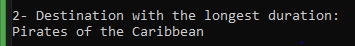

Lab 08: Magic Land Explorer
Problem Domain
This console application simulates exploring various destinations within Magic Land. The application reads data from an external JSON file containing information about different destinations, rides, shows, and dining options in the park. Users can interactively explore the available categories and destinations and view details about specific features using LINQ queries and delegates.

Program Specifications
Your solution should include the following:

Read the provided JSON file containing data about Magic Land destinations and features.
Parse the JSON data into your program.
Utilize LINQ queries and Lambda expressions (when possible) to perform data manipulation and filtering.
Provide an interactive console interface that allows users to see the results for each LINQ Query task.
Example:
Show filtered destinations
Show longest duration
Sort destinations by name
Show top 3 durations
Use delegates to handle user interactions and display information.
Use meaningful variable names and comments to improve code readability.
Ensure error handling for cases such as invalid user inputs or missing data if needed.
Step-by-Step Instructions
Step 1: Project Setup
Create the Project Structure:

Create a new C# console application.
Add necessary files: Category.cs, Destination.cs.
Add the provided JSON file to a data folder within the project.
Install Newtonsoft.Json:

In your Magic Land project, go to:

Tools > NuGet Package Manager > Package Manager Console
Install the Newtonsoft.Json package by running:
sh
Copy code
Install-Package Newtonsoft.Json
OR

sh
Copy code
dotnet add package Newtonsoft.Json
Example Code for Reading JSON Data:

csharp
Copy code
// Example code to read JSON data using Newtonsoft.Json
string json = File.ReadAllText("data/MagicLandData.json");
List<Category> categories = JsonConvert.DeserializeObject<List<Category>>(json);
Step 2: Define Classes for JSON Data
Destination Class:

Define properties for Name, Type, Location, Duration, and Description.

Category Class:

Define properties for CategoryName and a list of Destination objects.

Step 3: LINQ Query Tasks
Find all destination names with a duration less than 100 minutes.
Write a LINQ query to find and display the name of the destination with the longest duration among all categories.
Sort destinations alphabetically by their name.
Find the top three longest-duration destinations and show their names and durations.
Lab Structure
Your lab should be structured as follows:
```
css
Copy code
MagicLandExplorer/
│── Program.cs                 
│── Destination.cs             (1.5 Mark)
│── Category.cs                (1 Mark)
│── Tasks/
│   ├── FilterDestinations.cs  (1.5 Mark)
│   ├── LongestDuration.cs     (1.5 Mark)
│   ├── SortByName.cs          (1.5 Mark)
│   └── Top3Duration.cs        (1.5 Mark)
└── data/
│    └── MagicLandData.json
└── README.md                  (1 Mark)
```
Classes
Destination Class
Represents individual destinations available for exploration.

Properties:
Name: The name of the destination.
Type: The type of the destination (e.g., Ride, Show, Dining).
Location: The location of the destination within Magic Land.
Duration: The duration of the destination in minutes.
Description: A brief description of the destination.
Category Class
Represents categories of destinations.

Properties:
CategoryName: The name of the category.
Destinations: A list of Destination objects within the category.
Task Classes
FilterDestinations: Contains the method to get destinations with a duration less than 100 minutes.
LongestDuration: Contains the method to get the destination with the longest duration.
SortByName: Contains the method to sort destinations by name.
Top3Duration: Contains the method to get the top 3 longest-duration destinations

### Example Code

### Program.cs
```csharp
using Newtonsoft.Json;
using System;
using System.Collections.Generic;
using System.IO;
using System.Linq;

namespace MagicLandExplorer
{
    class Program
    {
        static void Main(string[] args)
        {
            // Construct the path to the JSON file
            string baseDirectory = AppDomain.CurrentDomain.BaseDirectory;
            string jsonFilePath = Path.Combine(baseDirectory, "data", "MagicLandData.json");

            // Check if the file exists
            if (!File.Exists(jsonFilePath))
            {
                Console.WriteLine($"The file {jsonFilePath} does not exist.");
                return;
            }

            try
            {
                // Read and deserialize the JSON file
                string json = File.ReadAllText(jsonFilePath);
                List<Category> categories = JsonConvert.DeserializeObject<List<Category>>(json);

                // Interactive Console Interface
                while (true)
                {
                    Console.WriteLine("Choose an option:");
                    Console.WriteLine("1- Show filtered destinations");
                    Console.WriteLine("2- Show longest duration");
                    Console.WriteLine("3- Sort destinations by name");
                    Console.WriteLine("4- Show top 3 durations");
                    Console.WriteLine("5- Exit");

                    var choice = Console.ReadLine();

                    switch (choice)
                    {
                        case "1":
                            var filteredDestinations = FilterDestinations.GetFilteredDestinations(categories);
                            Console.WriteLine("Destinations with duration less than 100 minutes:");
                            filteredDestinations.ForEach(d => Console.WriteLine(d.Name));
                            break;
                        case "2":
                            var longestDuration = LongestDuration.GetLongestDuration(categories);
                            Console.WriteLine("Destination with the longest duration:");
                            Console.WriteLine(longestDuration?.Name);
                            break;
                        case "3":
                            var sortedDestinations = SortByName.GetSortedDestinations(categories);
                            Console.WriteLine("Sorted destinations by name:");
                            sortedDestinations.ForEach(d => Console.WriteLine(d.Name));
                            break;
                        case "4":
                            var top3Durations = Top3Duration.GetTop3Durations(categories);
                            Console.WriteLine("Top 3 longest-duration destinations:");
                            top3Durations.ForEach(d => Console.WriteLine($"{d.Name} - {d.Duration} minutes"));
                            break;
                        case "5":
                            return;
                        default:
                            Console.WriteLine("Invalid choice. Please try again.");
                            break;
                    }
                }
            }
            catch (JsonReaderException ex)
            {
                Console.WriteLine($"Error reading JSON file: {ex.Message}");
            }
            catch (Exception ex)
            {
                Console.WriteLine($"An error occurred: {ex.Message}");
            }
        }
    }
}
```
### FilterDestinations.cs
```csharp
using System.Collections.Generic;
using System.Linq;

namespace MagicLandExplorer.Tasks
{
    public static class FilterDestinations
    {
        public static List<Destination> GetFilteredDestinations(List<Category> categories)
        {
            return categories
                .SelectMany(c => c.Destinations)
                .Where(d => d.Duration < 100)
                .ToList();
        }
    }
}
```
### LongestDuration.cs
```csharp
using System.Collections.Generic;
using System.Linq;

namespace MagicLandExplorer.Tasks
{
    public static class LongestDuration
    {
        public static Destination GetLongestDuration(List<Category> categories)
        {
            return categories
                .SelectMany(c => c.Destinations)
                .OrderByDescending(d => d.Duration)
                .FirstOrDefault();
        }
    }
}
````
### SortByName.cs
```csharp
using System.Collections.Generic;
using System.Linq;

namespace MagicLandExplorer.Tasks
{
    public static class SortByName
    {
        public static List<Destination> GetSortedDestinations(List<Category> categories)
        {
            return categories
                .SelectMany(c => c.Destinations)
                .OrderBy(d => d.Name)
                .ToList();
        }
    }
}
```
### Top3Duration.cs
```csharp
using System.Collections.Generic;
using System.Linq;

namespace MagicLandExplorer.Tasks
{
    public static class Top3Duration
    {
        public static List<Destination> GetTop3Durations(List<Category> categories)
        {
            return categories
                .SelectMany(c => c.Destinations)
                .OrderByDescending(d => d.Duration)
                .Take(3)
                .ToList();
        }
    }
}
```
### Destination.cs
```csharp
using Newtonsoft.Json;

namespace MagicLandExplorer
{
    public class Destination
    {
        public string Name { get; set; }
        public string Type { get; set; }
        public string Location { get; set; }

        [JsonConverter(typeof(DurationConverter))]
        public int Duration { get; set; }

        public string Description { get; set; }
    }
}
```
### Category.cs
```csharp
using System.Collections.Generic;

namespace MagicLandExplorer
{
    public class Category
    {
        public string CategoryName { get; set; }
        public List<Destination> Destinations { get; set; }
    }
}
```
### DurationConverter.cs
```csharp
using Newtonsoft.Json;
using System;

namespace MagicLandExplorer
{
    public class DurationConverter : JsonConverter<int>
    {
        public override int ReadJson(JsonReader reader, Type objectType, int existingValue, bool hasExistingValue, JsonSerializer serializer)
        {
            string durationString = (string)reader.Value;

```

### Output Screenshot



